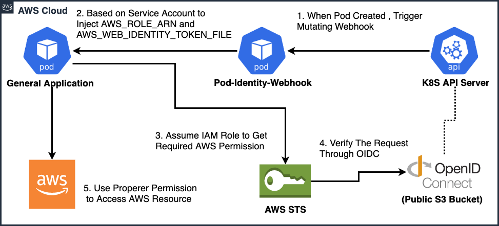

# Integrate AWS EKS Anywhere cluster with AWS Services

## Overview

Amazon EKS Anywhere is a new deployment option for Amazon EKS that allows customers to create and operate Kubernetes clusters on customer-managed infrastructure, supported by AWS. To learn more about EKS Anywhere follow this [link](https://aws.amazon.com/eks/eks-anywhere/)

It’s quite common for customers to self host certain infrastructure components like database and cache part of their own data center and use AWS for rest of their infrastructure needs to reduce the hosting cost. This blog post provides step-by-step instruction on integrating AWS EKS Anywhere with AWS Services so the applications running on customer data center can securely connect with these services.

## Customer benefits

Here are some key customer benefits:

* Customers no longer need to host all the infrastructure components required by their application stack part of their own data center. Depending upon their compliance requirements, customer can choose to host the minimal set of components part of their own data centers and use AWS for the rest of the infrastructure needs.
* Customers can use infrastructure as a code to create the AWS services and securely connect with them from their own data centers.
* Customers can leverage the standard mechanisms like **IRSA (IAM Role to Service Account mapping)**, used in AWS EKS to control applications access to these dependent AWS services.

## High level overview

[Amazon EKS Pod Identity Webhook](https://github.com/aws/amazon-eks-pod-identity-webhook) (maintained by AWS) is used to enable pod-level AWS authentication. With this approach the pods running on EKS Anywhere clusters can use the [IRSA](https://docs.aws.amazon.com/eks/latest/userguide/iam-roles-for-service-accounts.html) (IAM Role to Service Account) to control applications access to the dependent AWS services. The end-to-end flow is:



Webhook runs on EKS Anywhere clusters and enables applications to assume IAM role using annotations. The controller uses `OIDC service` to authenticate with AWS for assuming the specific IAM roles mentioned part of service account. With this mechanism there is no need for hard-coding the security credentials like `aws-security-key` and `authentication-key` part of the application pods.

ACK uses [IRSA](https://aws-controllers-k8s.github.io/community/docs/user-docs/irsa/) for authentication. By leveraging this feature we can enable IRSA on EKS Anywhere cluster, similar to AWS EKS. With ACK controllers in place applications running on EKS Anywhere cluster can now secure access AWS services on the cloud.

With this approach, here are two common access patterns:

* Customers with direct connect enabled between their data center and AWS, can use private links to allow application pods running on EKS Anywhere to access data from AWS services like S3, SQS, SNS, etc. through private links/endpoints without going through the internet.
* Customers without direct connect can use public endpoints (**with required security groups**) along with ACK controllers to allow access from application pods to the depdendent AWS services.

## Prerequisites

1. Golang need to be installed in the local environment, for instructions on how to install `golang` visit [here](https://golang.org/doc/install). Run the following command to validate if `golang` is installed in the local environment.

    ```bash
    go version 
    ```

    **Output:**

    ```bash
    go version go1.16.4 darwin/amd64
    ```

2. Make sure AWS cli is installed, and you have access to AWS IAM and S3 services, for instructions on how to install AWS cli visit [here](https://docs.aws.amazon.com/cli/latest/userguide/installing.html). Run the following command to validate if AWS cli is installed in the local environment.

    ```bash
    aws --version
    ```

    **Output:**

    ```bash
    aws-cli/2.2.27 Python/3.8.8 Darwin/20.6.0 exe/x86_64 prompt/off
    ```

3. Make sure `kubectl` is installed, and for instructions on how to install kubectl visit [here](https://kubernetes.io/docs/tasks/tools/install-kubectl/). Run the following command to validate if kubectl is installed in the local environment.

    ```bash
    kubectl version
    ```

    **Output:**

    ```bash
    Client Version: version.Info{Major:"1", Minor:"21", GitVersion:"v1.21.4", GitCommit:"3cce4a82b44f032d0cd1a1790e6d2f5a55d20aae", GitTreeState:"clean", BuildDate:"2021-08-11T18:16:05Z", GoVersion:"go1.16.7", Compiler:"gc", Platform:"darwin/amd64"}
    ```

4. Git is installed and configured on your machine, you can read more about it [here](https://git-scm.com/downloads)
5. Check out the resources thats required for this setup, by running the following command:

    ```bash
    mkdir eks-a-connect-with-aws.git && cd eks-a-connect-with-aws.git
    git clone https://github.com/hariohmprasath/eks-a-connect-with-aws.git .
    ```

## Assumptions

This blog post assumes that you already have an EKS Anywhere cluster running in a docker based on vSphere environment. For step by step instruction on creating a new EKS Anywhere cluster, refer [here](https://anywhere.eks.amazonaws.com/docs/getting-started/)

## Step by step guide

### Self-Signed Certificate for Pod Identity Webhook

At the end of this step a self-signed certificate will be generated under `certs/` directory and these certificates will be used for authenticating the pods with API server.

1. Run the following command to setup environment variables, clean up pre-existing certs

```bash
# Set environment variables
CERTIFICATE_PERIOD=365
POD_IDENTITY_SERVICE_NAME=pod-identity-webhook
POD_IDENTITY_SECRET_NAME=pod-identity-webhook
POD_IDENTITY_SERVICE_NAMESPACE=kube-system

# Cleanup existing certs (if any)
rm -rf certs
mkdir -p certs
```

2. Run the following command to generate self-signed certificate for pod identity webhook

```bash
openssl req \
        -x509 \
        -newkey rsa:2048 \
        -keyout certs/tls.key \
        -out certs/tls.crt \
        -days $CERTIFICATE_PERIOD -nodes -subj "/CN=$POD_IDENTITY_SERVICE_NAME.$POD_IDENTITY_SERVICE_NAMESPACE.svc"
```

**Output:**

```bash
Generating a 2048 bit RSA private key
...................................................................+++
..+++
writing new private key to 'certs/tls.key'
-----
```

3. Run the following command to generate pod identity webhook secret

```bash
kubectl create secret generic $POD_IDENTITY_SECRET_NAME \
        --from-file=./certs/tls.crt \
        --from-file=./certs/tls.key \
        --namespace=$POD_IDENTITY_SERVICE_NAMESPACE
```

**Output**

```bash
secret/pod-identity-webhook created
```

### Setup OIDC Discovery endpoints

Part of this step we will create a keypair, s3 bucket and upload the keypair to the s3 bucket.

1. Generate keypair, by running the following command

```bash
# Cleanup keys (if exists)
rm -rf keys
mkdir -p keys

# Environment variables
PRIV_KEY="keys/oidc-issuer.key"
PUB_KEY="keys/oidc-issuer.key.pub"
PKCS_KEY="keys/oidc-issuer.pub"

# Generate key pair
ssh-keygen -t rsa -b 2048 -f $PRIV_KEY -m pem -N ""

# convert SSH pubkey to PKCS8
ssh-keygen -e -m PKCS8 -f $PUB_KEY > $PKCS_KEY
```

**Output:**

```bash
Generating public/private rsa key pair.
Your identification has been saved in keys/oidc-issuer.key.
Your public key has been saved in keys/oidc-issuer.key.pub.
```

2. Create S3 bucket, setup OIDC discovery endpoints and upload the configuration to the S3 bucket

```bash
# Environment variables
timestamp=$(date +%s)
AWS_DEFAULT_REGION=$(aws configure get region)
AWS_DEFAULT_REGION=${AWS_DEFAULT_REGION:-us-west-2}
S3_BUCKET=aws-irsa-oidc-$timestamp
HOSTNAME=s3-$AWS_DEFAULT_REGION.amazonaws.com
ISSUER_HOSTPATH=$HOSTNAME/$S3_BUCKET

# Create S3 Bucket, with timestamp and default region
aws s3api create-bucket --bucket $S3_BUCKET --create-bucket-configuration LocationConstraint=$AWS_DEFAULT_REGION

# Create discover.json and host an OIDC discovery endpoint
cat <<EOF > discovery.json
{
    "issuer": "https://$ISSUER_HOSTPATH/",
    "jwks_uri": "https://$ISSUER_HOSTPATH/keys.json",
    "authorization_endpoint": "urn:kubernetes:programmatic_authorization",
    "response_types_supported": [
        "id_token"
    ],
    "subject_types_supported": [
        "public"
    ],
    "id_token_signing_alg_values_supported": [
        "RS256"
    ],
    "claims_supported": [
        "sub",
        "iss"
    ]
}
EOF

# Utility that helps in generating `discovery.json` and `keys.json`
go run ./main.go -key $PKCS_KEY  | jq '.keys += [.keys[0]] | .keys[1].kid = ""' > keys.json

# List all keys
ls keys

# After you have the `keys.json` and `discovery.json` files, you'll need to place them in your bucket. It is critical these objects are public so STS can access them.
aws s3 cp --acl public-read ./discovery.json s3://$S3_BUCKET/.well-known/openid-configuration
aws s3 cp --acl public-read ./keys.json s3://$S3_BUCKET/keys.json
```

**Output:**

```bash
{
    "Location": "http://aws-irsa-oidc-xxxxxx.s3.amazonaws.com/"
}
oidc-issuer.key     oidc-issuer.key.pub oidc-issuer.pub
upload: ./discovery.json to s3://aws-irsa-oidc-xxxxxx/.well-known/openid-configuration
upload: ./keys.json to s3://aws-irsa-oidc-xxxxxx/keys.json
```

3. Create OIDC identity provider and set up `thumbprint`

```bash
# Setup thumbprint
CA_THUMBPRINT=$(openssl s_client -connect s3-$AWS_DEFAULT_REGION.amazonaws.com:443 -servername s3-$AWS_DEFAULT_REGION.amazonaws.com -showcerts < /dev/null 2>/dev/null  |  openssl x509 -in /dev/stdin -sha1 -noout -fingerprint | cut -d '=' -f 2 | tr -d ':')

# Create OIDC provider
aws iam create-open-id-connect-provider \
    --url https://$ISSUER_HOSTPATH \
    --thumbprint-list $CA_THUMBPRINT \
    --client-id-list sts.amazonaws.com

echo "The service-account-issuer as below:"
echo "https://$ISSUER_HOSTPATH"
```

**Output:**

```bash
{
    "OpenIDConnectProviderArn": "arn:aws:iam::xxxxxx:oidc-provider/s3-us-xxx-x.amazonaws.com/aws-irsa-oidc-xxxxxx"
}
```

### Updating Kubernetes API Server configuration

Kubernetes API server configuration needs to be updated with the following flags to enable integration with OIDC provider.

* `--service-account-key-file` - Path to the `$PKCS_KEY `file from the beginning.
* `--service-account-signing-key-file` - Path to the signing (`private`) key (`$PRIV_KEY`)
* `--api-audiences` - Identifiers of the API. The service account token authenticator will validate that tokens used against the API are bound to at least one of these audiences.
* `--service-account-issuer` - The issuer URL, or `https://$ISSUER_HOSTPATH` from above.

Here are the step by step instruction for updating the Kubernetes API server.

1. Kubernetes API server needs to be configured with the public and private keys that we created in the previous step. The keys are available part of `keys` directory.

```bash
# Get control plane name details and set docker ID in environment variable
export PS_ID=$((docker ps | grep $(kubectl get node --selector='node-role.kubernetes.io/master' --no-headers -o custom-columns=":metadata.name")) | awk '{print $1}')

# Copy keys from local to control plane container
docker cp keys/oidc-issuer.key $PS_ID:/etc/kubernetes/manifests/secrets
docker cp keys/oidc-issuer.key.pub $PS_ID:/etc/kubernetes/manifests/secrets
docker cp keys/oidc-issuer.pub $PS_ID:/etc/kubernetes/manifests/secrets
```

2. Edit `kube-apiserver` (under `/etc/kubernetes/manifests/kube-apiserver.yaml`) manifest file, with the following changes:

* Make sure the following parameters are set based on the output of the previous steps

```bash
--service-account-key-file=/etc/kubernetes/manifests/secrets/oidc-issuer.pub
--service-account-signing-key-file=/etc/kubernetes/manifests/secrets/oidc-issuer.key
--api-audiences=sts.amazonaws.com
--service-account-issuer=https://s3-us-xxxx-x.amazonaws.com/aws-irsa-oidc-xxxxxx #Replace this with the https://$ISSUER_HOSTPATH in previous step
```

* Append the below configuration to `volumes` section of the manifest file.

```bash
- hostPath:
    path: /etc/kubernetes/manifests/secrets
    type: DirectoryOrCreate
    name: k8s-secrets
```  

* Append the below configuration to `volumesMounts` section of the manifest file.

```bash
- mountPath: /etc/kubernetes/manifests/secrets
    name: k8s-secrets
    readOnly: true
```

* Append the below configuration to `env` (if doesnt exist, add it) section of the manifest file.

```bash
env:
- name: GODEBUG
  value: "x509ignoreCN=0"
```

3. Save the configuration file and exit the editor. This wil trigger a automatic restart of the `kube-apiserver` server, in couple of minutes. Run the following command to check the status of the `kube-apiserver` server.

```bash
# Check status of kube-apiserver
crictl ps | grep kube-apiserver

# Once the status is running, run the below command to set the environment variable
export PID=$((crictl ps | grep kube-apiserver) | awk '{print $1}')

# Check the logs of the API server, by running the following command
crictl logs $PID
```

4. Exit the container by typing `exit` command and run the following command to restart all the pods that has run into `CrashlookBackOff` state because of API server restart.

```bash
kubectl get pods --all-namespaces | grep CrashloopBackOff | awk '{print $2 " --namespace=" $1}' | xargs kubectl delete pod
```

5. After couple of minutes all the pods will be restarted and should get to the `RUNNING` state, which can be checked with the following command:

```bash
kubectl get pods --all-namespaces
```

### Deploy Pod Identity Webhook

Run the following command to deploy the Pod Identity webhook.

```bash
cat pod-identity-webhook/mutatingwebhook.yaml | ./webhook-patch-ca-bundle.sh > pod-identity-webhook/mutatingwebhook-ca-bundle.yaml

# deploy the pod identity webhook related k8s resources
echo 'Applying configuration to active cluster...'

kubectl create -f pod-identity-webhook/auth.yaml
kubectl create -f pod-identity-webhook/deployment.yaml
kubectl create -f pod-identity-webhook/service.yaml
kubectl create -f pod-identity-webhook/mutatingwebhook-ca-bundle.yaml
```

> Pod Identity Webhook will start monitoring pods that are newly created and automatically inject them with `AWS_IAM_ROLE_ARN` and `AWS_WEB_IDENTITY_TOKEN_FILE` environment variables.

### Setup Certificate Authority

1. Setup environment variables for the certificate authority.

```bash
export POD_IP=$((kubectl get pods -o wide -n kube-system | grep pod-identity-webhook) | awk '{print $6}')
export SERVICE_IP=$((kubectl get services -o wide -n kube-system | grep pod-identity-webhook) | awk '{print $3}')
```

2. Create a certificate signing request

```bash
cat <<EOF | cfssl genkey - | cfssljson -bare server
{
  "hosts": [
    "pod-identity-webhook.kube-system.svc.cluster.local",
    "pod-identity-webhook.kube-system.pod.cluster.local",
    "192.168.xx.xx", #replace this with POD_IP
    "10.135.xx.xx" # replace this with SERVICE_IP
  ],
  "CN": "system:node:pod-identity-webhook.kube-system.pod.cluster.local",
  "key": {
    "algo": "ecdsa",
    "size": 256
  },
  "names": [
    {
      "O": "system:nodes"
    }
  ]
}
EOF
```

> Note: Make sure to replace **POD_IP** and **SERVICE_IP** with the corresponding values from the previous step.

**Output**

```bash
2017/03/21 06:48:17 [INFO] generate received request
2017/03/21 06:48:17 [INFO] received CSR
2017/03/21 06:48:17 [INFO] generating key: ecdsa-256
2017/03/21 06:48:17 [INFO] encoded CSR
```

3. Create a Certificate Signing Request object to send to the Kubernetes API

```bash
cat <<EOF | kubectl apply -f -
apiVersion: certificates.k8s.io/v1
kind: CertificateSigningRequest
metadata:
  name: pod-identity-webhook.kube-system
spec:
  request: $(cat server.csr | base64 | tr -d '\n')
  signerName: kubernetes.io/kubelet-serving
  usages:
  - digital signature
  - key encipherment
  - server auth
EOF
```

**Output**

```bash
certificatesigningrequest.certificates.k8s.io/pod-identity-webhook.kube-system created
```

4. Approve the Certificate Signing Request, by running the following command:

```bash
kubectl certificate approve pod-identity-webhook.kube-system
```

**Output**

```bash
certificatesigningrequest.certificates.k8s.io/pod-identity-webhook.kube-system approved
```

5. Run the following command to verify whether the `csr` has been `Approved`

```bash
kubectl get csr
```

**Output**

```bash
NAME                               AGE   SIGNERNAME                      REQUESTOR          CONDITION
pod-identity-webhook.kube-system   48s   kubernetes.io/kubelet-serving   kubernetes-admin   Approved,Issued
```

## Verification

Lets deploy a test workload (a kubernetes job) to verify application access to AWS S3 service

1. Create IAM role and assign permissions for the test workload

```bash
# Set environment variables
ISSUER_URL=https://$ISSUER_HOSTPATH
ISSUER_HOSTPATH=$(echo $ISSUER_URL | cut -f 3- -d'/')
ACCOUNT_ID=$(aws sts get-caller-identity --query Account --output text)
PROVIDER_ARN="arn:aws:iam::$ACCOUNT_ID:oidc-provider/$ISSUER_HOSTPATH"
ROLE_NAME=s3-echoer
AWS_DEFAULT_REGION=$(aws configure get region)
AWS_DEFAULT_REGION=${AWS_DEFAULT_REGION:-us-west-2}

# Create assume role policy with ISSUER_URL
cat > irp-trust-policy.json << EOF
{
  "Version": "2012-10-17",
  "Statement": [
    {
      "Effect": "Allow",
      "Principal": {
        "Federated": "$PROVIDER_ARN"
      },
      "Action": "sts:AssumeRoleWithWebIdentity",
      "Condition": {
        "StringEquals": {
          "${ISSUER_HOSTPATH}:sub": "system:serviceaccount:default:${ROLE_NAME}"
        }
      }
    }
  ]
}
EOF

# Create IAM role for workload
aws iam create-role \
        --role-name $ROLE_NAME \
        --assume-role-policy-document file://irp-trust-policy.json

# Assign policies to the role
aws iam update-assume-role-policy \
        --role-name $ROLE_NAME \
        --policy-document file://irp-trust-policy.json

aws iam attach-role-policy \
        --role-name $ROLE_NAME \
        --policy-arn arn:aws:iam::aws:policy/AmazonS3FullAccess

```

2. Create kubernetes `serviceaccount` and `s3-tester-job` kubernetes job. Associate the kubernetes job with the newly created service account

```bash
# Create service account for s3 echoer job and attach the iam role
S3_ROLE_ARN=$(aws iam get-role --role-name $ROLE_NAME --query Role.Arn --output text)
kubectl create sa s3-echoer
kubectl annotate sa s3-echoer eks.amazonaws.com/role-arn=$S3_ROLE_ARN

# Test workload
cat <<EOF | kubectl apply -f -
apiVersion: batch/v1
kind: Job
metadata:
  name: s3-tester-job
spec:
  template:
    spec:
      serviceAccountName: s3-echoer
      containers:
      - name: main
        image: public.ecr.aws/amazonlinux/amazonlinux:latest
        command:
        - "sh"
        - "-c"    
        - "sleep 10000000"          
        env:
        - name: AWS_DEFAULT_REGION
          value: "us-xxxx-xxx" # Make sure the right default region is set
        - name: ENABLE_IRP
          value: "true"
      restartPolicy: Never
EOF
```

**Output**

```bash
serviceaccount/s3-echoer created
serviceaccount/s3-echoer annotated
job.batch/s3-tester-job created
```

3. Login to the `s3-tester-job` pod by run the following commands:

```bash
export TEST_POD=$(kubectl get pods -A | grep s3-tester-job | awk '{print $2}')
kubectl exec -it $TEST_POD bash
```

**Output**

```bash
bash:
```

4. Install `awscli` and run a simple test command `aws s3 ls` to check whether the pod has access to AWS S3 service

```bash
yum install awscli -y
aws s3 ls
```

**Output**

```bash
2021-10-06 06:53:02 aws-irsa-oidc-xxxxxx
```

5. Run the following command to cleanup the test workload and delete the associated service account

```bash
kubectl delete job s3-tester-job
kubectl delete sa s3-echoer
```

## Conclusion

We have shown how to integrate AWS EKS Anywhere with AWS Services so the applications running on customer datacenter can securely connect to these dependent AWS services. This provides the customer with the flexibility on deciding which all services will be self-hosted on-prem vs directly access from AWS.

## Resources

* [Amazon EKS Pod Identity Webhook](https://github.com/aws/amazon-eks-pod-identity-webhook)
* [Self hosted kubernetes setup](https://github.com/aws/amazon-eks-pod-identity-webhook/blob/master/SELF_HOSTED_SETUP.md)
* [AWS IRSA For Self-Hosted Kubernetes](https://medium.com/getamis/aws-irsa-for-self-hosted-kubernetes-e045564494af)
* [Manage TLS Certificates in a Cluster](https://kubernetes.io/docs/tasks/tls/managing-tls-in-a-cluster/)